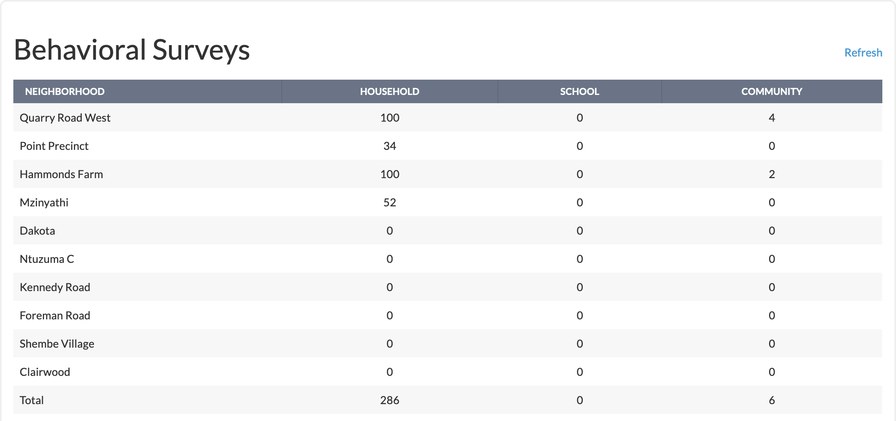
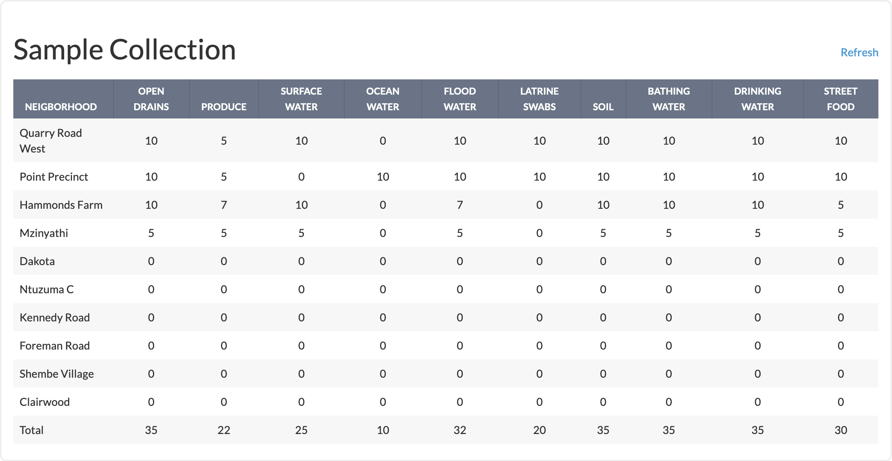
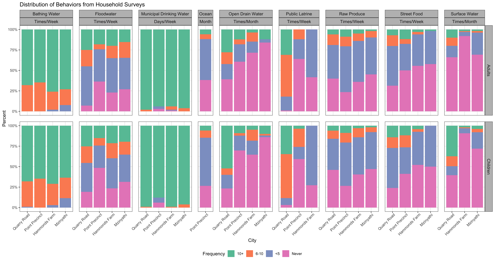
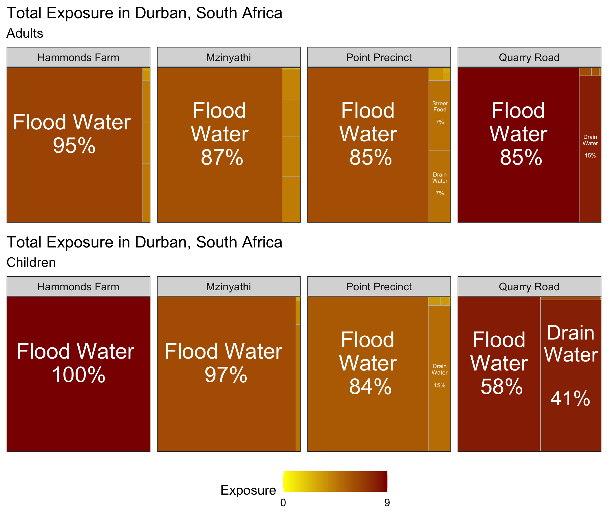

```{r setup, include=FALSE}
knitr::opts_chunk$set(echo = FALSE)

library(htmltools)
setwd("/Users/caseysiesel/Desktop/SaniPath/")
sapply(grep('.R$', list.files('/Users/caseysiesel/Desktop/SaniPath/model', full.names = T), value=T), source)
library(readr)
library(tidyverse)
library(readxl)

print(getwd())
config <- yaml::yaml.load_file('/Users/caseysiesel/Desktop/SaniPath/model/config.yaml')
config$mpn_tbl <- read_csv('/Users/caseysiesel/Desktop/SaniPath/rsrc/mpn_tbl.csv') %>% as.matrix()
config$intake <- read_csv('/Users/caseysiesel/Desktop/SaniPath/rsrc/intake.csv') %>% as.matrix()
options(scipen=999999999)


col <- read_excel("~/Downloads/Sample_Survey-xlsform_spdurban_final_2020_04_02_18_27_30.xlsx")
col$col_sample_type <- as.numeric(col$col_sample_type)
lab <- read_excel("~/Downloads/IDEXX_Lab-xlsform_spdurban_final_2020_04_02_18_31_28.xlsx")
lab$lab_sample_type <- as.numeric(lab$lab_sample_type)

pathway_codes = list('d' = 1, 'p' = 2, 'dw' = 3, 'o' = 4, 's' = 5, 'f' = 6, 'l' = 7,
                     'pa' = 8, 'bw' = 9, 'sf' = 10)
pathway_labels =list('d' = 'Drain Water', 'p' = 'Produce', 'dw' = 'Municipal and Piped Water', 'o' = 'Ocean Water',
                     's' = 'Surface Water', 'f' = 'Flood Water', 'l' = 'Public Latrine',
                     'pa' = 'Particulate', 'bw' = 'Bathing Water', 'sf' = 'Street Food')
neighbs = list("Quarry Road" = 421, "Point Precinct"=422, "Hammonds Farm" =423, "Mzinyathi"=424)

##### creating SPT e. coli results and conc_data for plotting ####
df.ecdata <- create_ecData(collection_data=col, lab_data=lab, mpn_tbl=config$mpn_tbl, reading=config$idexx_reading,
                         value=config$idexx_value, denoms=config$denoms, MF=F)


df.ecdata$std_ec_conc <- 0

#change group_by(sample_type, 2ND VARIABLE HERE) depending on what is used to standardize (city right now)

library(readr)
library(flexdashboard)
library(DT)
library(ggplot2)
library(ggcal)
library(readxl)
library(dplyr)
library(bindr)
library(plotly)
library(expss)
library(parallel)
library(knitr)
library(kableExtra)
library(cowplot)
library(purrr)
library(leaflet)
library(ggridges)
library(ggtext)
library(RColorBrewer)


max_min <- df.ecdata %>% group_by(sample_type) %>% summarise(max=max(ec_conc, na.rm=TRUE), min=min(ec_conc, na.rm=TRUE))
for(i in 1:nrow(df.ecdata)){
  if(is.na(df.ecdata$ec_conc[i])){
    df.ecdata$std_ec_conc[i]=NA
  }
  else{
    max<-log10(max_min$max[which(max_min$sample_type==df.ecdata$sample_type[i])])
    min<-log10(max_min$min[which(max_min$sample_type==df.ecdata$sample_type[i])])
    df.ecdata$std_ec_conc[i]=(log10(df.ecdata$ec_conc[i])-min)/(max-min)
  }
}

df.ecdata$sample_type <- factor(df.ecdata$sample_type, levels=c("1", "2", "3",
                                                  "4", "5", "6", "7", "8",
                                                  "9","10"), labels=c("1"="Open Drains", "2"="Raw Produce", "3"="Drinking Water",
                                                                      "4"="Ocean Water", "5"="Surface Water", "6"="Floodwater",
                                                                      "7"="Public Latrines", "8"="Soil",
                                                                      "9"="Bathing Water","10"="Street Food"))

df <- df.ecdata

colnames(df)[colnames(df)=="_col_location_latitude"] <- "lat"
colnames(df)[colnames(df)=="_col_location_longitude"] <- "lon"

df <- df %>% filter_all(all_vars(!is.na(std_ec_conc)))

#Setting standard cutoffs
cutoff <- c(0, .25, .50, 0.75, 1)
df <- df %>% mutate(dot_label = case_when(std_ec_conc <= cutoff[[2]] ~ 1,
                                          std_ec_conc > cutoff[[2]] & std_ec_conc <= cutoff[[3]] ~ 2,
                                          std_ec_conc > cutoff[[3]] & std_ec_conc <= cutoff[[4]] ~ 3,
                                          std_ec_conc > cutoff[[4]] & std_ec_conc <= cutoff[[5]] ~ 4))
df <- df %>% mutate(dot_color = case_when(dot_label == 1 ~ "green",
                                          dot_label == 2 ~ "yellow",
                                          dot_label == 3 ~ "orange",
                                          dot_label == 4 ~ "red"))
cutoff1 <- c("Minimal", "Low", "Medium", "High")
# cutoff1 <- sprintf("%.2f", round(cutoff1, 2))
color1 <- c("green", "yellow", "orange", "red")


map_cont <- leaflet() %>% 
  addTiles() %>%
  addCircles(data=df, lng=~lon, lat=~lat,
             label = htmlEscape(paste0(df$sample_type, ", ", sprintf("%.2f", round(df$std_ec_conc, 2)), " Normalized E.coli", " (log10)")),
             weight = 3, radius=10, color=~dot_color, stroke = TRUE, fillOpacity = 1) %>%
  addLegend("bottomright", colors = color1, labels = cutoff1,
            title = "Fecal Contamination Risk Scale") %>%
  addScaleBar("bottomleft")


df.ecdata$neighbor <- factor(df.ecdata$neighbor, labels=c("421"="Quarry Road", "422"="Point Precinct",
                                                          "423"="Hammonds Farm", "424"= "Mzinyathi"))


df2 <- df.ecdata %>%
  group_by(sample_type) %>%
  summarise(mean.cont = mean(log10(ec_conc), na.rm=TRUE))


df.ecdata$neighbor <- factor(df.ecdata$neighbor, labels=c("421"="Quarry Road", "422"="Point Precinct",
                                                          "423"="Hammonds Farm", "424"= "Mzinyathi"))


df.ecdata$SES <- ifelse(df.ecdata$neighbor=="Quarry Road", "low income",
                        ifelse(df.ecdata$neighbor=="Point Precinct", "middle income",
                               ifelse(df.ecdata$neighbor=="Hammonds Farm", "low income",
                                      ifelse(df.ecdata$neighbor=="Mzinyathi", "low income", NA))))


asdf <- df.ecdata %>%
  group_by(sample_type, neighbor) %>%
  summarise(n=n(), num_samples = sum(!is.na(ec_conc)), 
            mean = mean(log10(ec_conc), na.rm=T), 
            min_max = paste0(min(log10(ec_conc), na.rm=T), " - ", max(log10(ec_conc), na.rm=T))) %>%
  mutate(samples = paste0(num_samples, "/",n))


plots <- list()
for(i in unique(df.ecdata$sample_type)){
  
  df2a <- df2 %>% filter(sample_type==i)
  asdf2 <- asdf %>% filter(sample_type==i)
  x<-df.ecdata %>%
    filter(sample_type == i) %>%
    #add linetype=SES in the below aes to get lines by SES
    ggplot(., aes(y=factor(neighbor, levels=(unique(neighbor))), x=log10(ec_conc))) +
    geom_density_ridges(aes(fill=neighbor), quantile_lines=TRUE, quantiles=2, panel_scaling=FALSE
                        #comment this chunk out to get rid of lines: from here
                        ,
                        jittered_points = TRUE,
                        # position = position_points_jitter(width = 0.05, height = 0),
                        # point_shape = '|',
                        point_size = 0.75,
                        point_alpha = 0.5,
                        alpha = 0.7,
                        show.legend=FALSE
                        #to here
    ) +
    geom_point(aes(x=0, colour=SES),size=0, alpha=0, show.legend=FALSE) +
    geom_text(data=asdf2, aes(x=9.5, label=samples), color="grey") +
    geom_vline(data=df2a, aes(xintercept=mean.cont), color="red", show.legend=FALSE) +
    guides(colour = guide_legend(override.aes = list(size=3,linetype=0, alpha=1))) +
    labs(fill = "City",
         colour = "SES (neighborhood label color)",
         x = "",
         y = "",
         title=i) +
    scale_color_manual(values = c("darkred", "darkblue", "darkgreen", "orange", "purple"), 
                       breaks = c("very low income", "low income", "middle income", "high income", "unknown")) +
    # scale_linetype_manual(values=c("solid", "dashed", "dotted", "twodash")) +
    theme_bw() +
    theme(axis.text.x = element_text(hjust = 0.95, vjust = 0.2),
          axis.text=element_text(size=8),
          axis.text.y = element_markdown(),
          strip.background = element_rect(fill="white"),
          legend.position="bottom",
          legend.justification="center",
          legend.box = "vertical") +
    scale_fill_manual(values=c("Quarry Road"="#1D6996", "Point Precinct"="#73AF48", 
                               "Hammonds Farm"="#CC503E", "Mzinyathi"="#994E95")) +
    scale_x_continuous(breaks = c(0,2,4,6,8,10)) +
    xlim(-1,10)

  plots[[i]] <- x
  
}

plot_cont <- cowplot::plot_grid(plotlist=plots, nrow=5, axis='tblr')


```


## Data Collection Overview

```{r surveySamples, out.width="100%"}

tags$br()

```

## Behaviors across Neighborhoods and Ages
```{r behavior, out.width="100%"}

```


## Environmental Contamination across Sample Types

```{r contamination, fig.width=14, fig.height=8}
plot_cont
```

## Map of Contamination
```{r map, out.width="100%"}
map_cont
```


## Exposure Treemap
```{r exposure, fig.align="center"}

```

## Dominant Pathways

Neighborhood         Adult                      Child
-----------------    -------------------------  -----------------------
Quarry Road          Open Drains, Floodwater    Open Drains, Floodwater
Point Precinct       Floodwater                 Open Drains, Floodwater
Hammonds Farm        Floodwater                 Floodwater
Mzinyathi            Floodwater                 Floodwater

Table: Table of Dominant Pathways
